

# استخراج ویژگی از سیگنال صوت

<h4>منابع:</h4>

بخشی از مطالب و تصاویر استفاده شده در این مخزن، از  <a href = "https://www.youtube.com/playlist?list=PL-wATfeyAMNqIee7cH3q1bh4QJFAaeNv0">دوره پردازش سیگنال</a>
برداشته شده است و با هماهنگی و اجازه مدرس دوره (<a href="https://www.linkedin.com/in/valeriovelardo/">Valerio Velardo</a>) در اینجا قرار داده شده. همچنین بخشی از مطالب متعلق به دوره مبانی پردازش زبان و گفتار، تدریس شده توسط استاد 
<a href="https://scholar.google.com/citations?user=SpBXgZUAAAAJ&hl=en">معطر</a> می‌باشد.
## انواع ویژگی‌های سیگنال صوت

به طور کلی ویژگی‌های سیگنال صوت (در حوزه سیگنال) میتوانند در سه دسته‌ی زیر قرار گیرند:

۱. ویژگی‌های حوزه زمان (Time domain features):

این ویژگی‌های قابل استخراج از شکل موج در حوزه زمان (  `Waveform` ) می‌باشند. 

- `Amplitude envelope` 
- `Root-mean square energy`
- `Zero crossing rate`
- ...

اما بدیهی است که فرکانس نیز تا حد زیادی می‌تواند توصیف کننده سیگنال صوت باشد. بنابراین دسته دیگری از ویژگی‌ها نیز مورد نیاز می‌باشند.

۲. ویژگی‌های حوزه فرکانس (Frequency domain features):

می‌توان با اعمال تبدیل فوریه بر روی سیگنال در حوزه‌ی زمان، سیگنال را در حوزه‌ی فرکانس نمایش داد. در اینصورت برخی از ویژگی‌هایی که از این نمایش قابل استخراج می‌باشند عبارتند از:

- `Band energy ratio` 
- `Spectral centroid`
- `Spectral flux`
- ...

همانطور که گفته شد، در هر یک از حوزه‌های بالا، تنها ویژگی‌های مربوط به همان حوزه قابل استخراج است. اما دسته‌ی دیگری از ویژگی‌ها وجود دارند که اطلاعاتی را در هر دو این حوزه‌ها در اختیار ما قرار می‌دهند.

۳. ویژگی‌های حوزه‌ی زمان-فرکانس (Time-frequency features):

برای استخراج اینگونه ویژگی‌ها می‌توان از نمایش‌های حوزه‌ی زمان-فرکانس استفاده نمود:

- `Spectrogram` 
- `Mel-Spectrogram`
- `Constatn-Q transform`
- ...

## روال کلی استخراج ویژگی‌های حوزه‌ی زمان و فرکانس

#### روال کلی استخراج ویژگی در حوزه زمان:

۱. ابتدا سیگنال آنالوگ طی فرآیند `Analog to digital conversion (ADC)` به سیگنال دیجیتال تبدیل می‌گردد. این فرآیند خود شامل دو مرحله `نمونه برداری (sampling)` و `چندی سازی (quantization)` می‌باشد.

۲. سپس سیگنال دیجیتال حاصل فریم بندی (`framing`) می‌شود. 

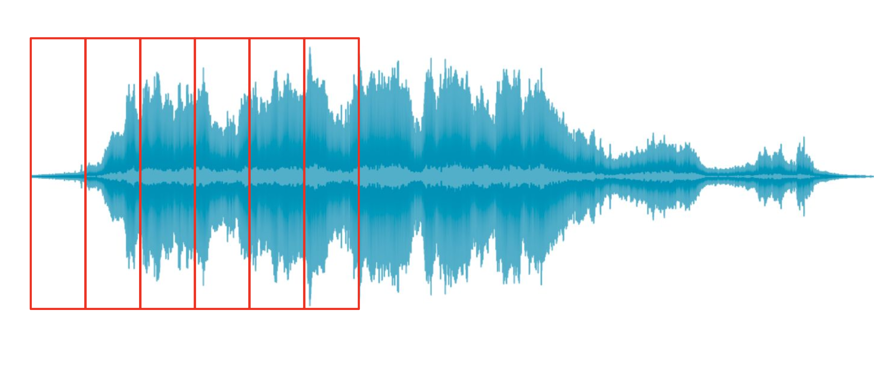</img>

معمولا برای سرعت بخشیدن به فرآیند تبدیل فوریه سریع، تعداد نمونه‌های موجود در هر فریم توانی از دو می‌باشد.
مدت یک فریم برابر است با:

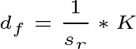

که در آن *s**r* برابر با فرکانس نمونه‌برداری (sampling rate) و K برابر با تعداد نمونه‌های موجود در یک فریم (frame size) می‌باشد.

۳. در این مرحله آماده‌ی محاسبه ویژگی‌های حوزه‌ي زمان در هر یک از فریم‌ها هستیم. 

۴. پس از محاسبه ویژگی‌ها می توان با ترکیب آنها، یک بردار یا ماتریس ویژگی برای کل سیگنال تشکیل داد.

این فرآیند در شکل زیر به خوبی قابل مشاهده می‌باشد:

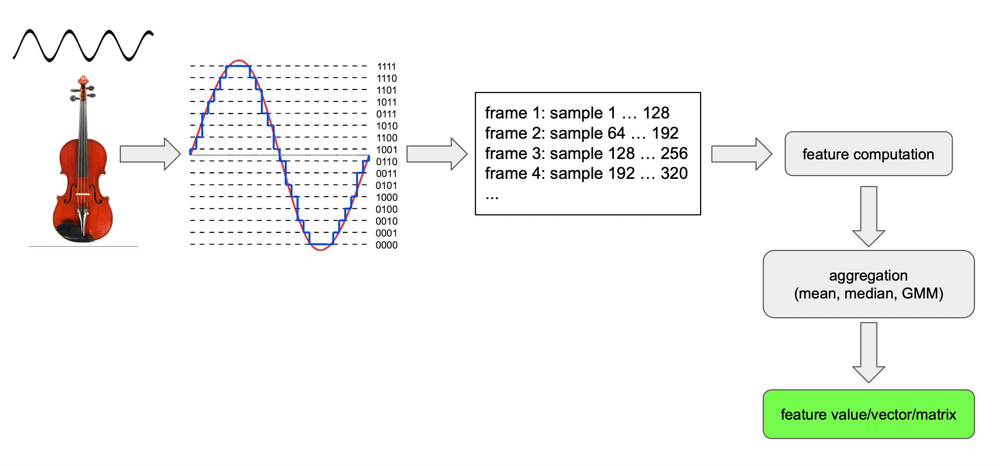</img>

---

#### روال کلی استخراج ویژگی در حوزه فرکانس:

مراحل ابتدایی مانند روال قبل اجرا می‌شوند

۱. ابتدا سیگنال آنالوگ طی فرآیند `Analog to digital conversion (ADC)` به سیگنال دیجیتال تبدیل می‌گردد. 

۲. سپس سیگنال دیجیتال حاصل فریم بندی (`framing`) می‌شود. 

سپس باید سیگنال را از حوزه‌ی زمان وارد حوزه‌ي فرکانس کنیم. این فرآیند معمولا با استفاده از تبدیل فوریه انجام می‌گردد. حاصل نموداری است که نشان دهنده‌ی تأثیر فرکانس‌های مختلف در سیگنال می‌باشد.

<strong>
اما پیش از انجام این تبدیل باید مسئله ای به نام `spectral leakage(نشت طیفی)` مورد بررسی قرار گیرد.
</strong>
---

> #### Spectral leakage:

> زمانی که تبدیل فوریه سیگنالی را محاسبه می‌کنیم که تعداد تناوب‌های آن عددی صحیح نمی‌باشد، با این مسئله روبرو می‌شویم. بنابراین واضح است که این مسئله بسیار در فریم‌ها رخ می‌دهد، زیرا وجود فریمی که شامل تعداد صحیحی تناوب باشد بسیار نادر است.
> اتفاقی که معمولا رخ می‌دهد این است که ابتدا و انتهای سیگنال نامتناوب است ( زیرا یک تناوب کامل را تشکیل نمی‌دهند ). این نواحی زمانی که به حوزه‌ی فرکانس تبدیل می‌گردند، تبدیل به فرکانس‌های بالا می‌شوند که در واقعیت وجود ندارند و صرفا حاصل نواحی نامتناوب ابتدا و انتها می‌باشند.

---

۳. برای حل این مشکل مرحله‌ی جدیدی به نام پنجره گذاری (windowing) انجام می‌شود. در این مرحله یک تابع پنجره گذاری بر روی هر فریم اعمال می‌گردد. پنجره‌ گذاری در واقع نمونه‌های ابتدایی و انتهایی هر فریم را حذف می‌کند که سبب به وجود آمدن سیگنالی نسبتا متناوب می‌شود. در نتیجه نشت طیفی کاهش می‌یابد.

در شکل زیر یکی از توابع پنجره گذاری پر کاربرد قابل مشاهده است (تابعی از هر نمونه k):

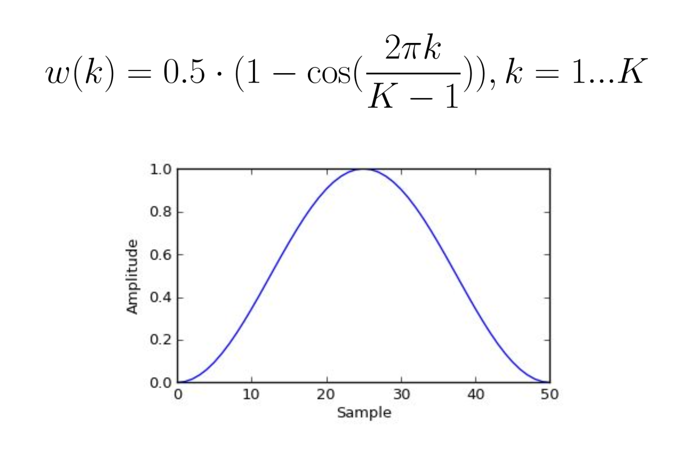</img>

این تابع به صورت زیر بر روی سیگنال اعمال می‌گردد (بر روی هر نمونه):

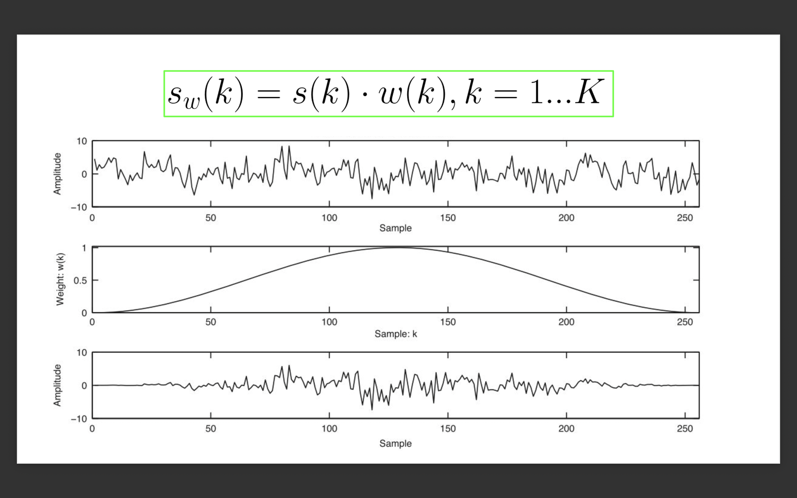</img>

همانطور که در شکل قابل مشاهده است، ابتدا و انتهای سیگنال حذف شده‌اند.

<b> اما حالا با مشکل دیگری روبرو هستیم. برای درک این مشکل تصور کنید که چند فریم را در کنار یکدیگر قرار داده‌ایم، در اینصورت می‌توانید در شکل زیر مشاهده کنید که در ابتدا و انتهای هر فریم ما سیگنال را در نتیجه فرآیند پنجره‌گذاری از دست داده‌ایم و طبیعتا نمی‌خواهیم  سیگنالی را از دست دهیم.</b>

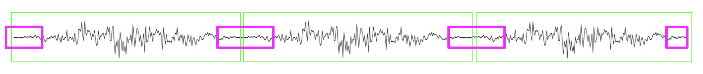</img>

---

> Overlapping Frames:

> برای حل این مشکل فریم‌بندی را به گونه‌ای انجام می‌دهیم که فریم‌ها با همدیگر همپوشانی داشته باشند. در اینصورت می‌توانیم تا حدی اطلاعات از دست رفته در شکل بالا را جبران نماییم.
در شکل زیر فریم اول و دوم به با هم همپوشانی دارند. به تعداد نمونه‌هایی که از ابتدا هر فریم تا ابتدا فریم بعدی قرار دارد مقدار شیفت یا پرش (hop length) گویند. اگر اندازه هر فریم را برابر با K در نظر بگیریم، اندازه همپوشانی برابر با `K - hop length` خواهد بود.
---

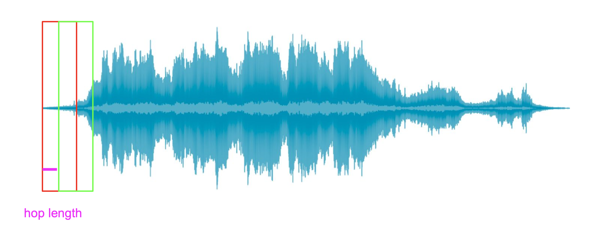</img>

۴.در این مرحله تبدیل فوریه اعمال می‌گردد

مراحل بعدی مانند فرآیند قبلی در حوزه زمان انجام می‌شوند:

۵. محاسبه ویژگی‌های حوزه فرکانس.

۶.  پس از محاسبه ویژگی‌ها می توان با ترکیب آنها، یک بردار یا ماتریس ویژگی برای کل سیگنال تشکیل داد.

این فرآیند نیز در شکل زیر به خوبی قابل مشاهده می‌باشد:

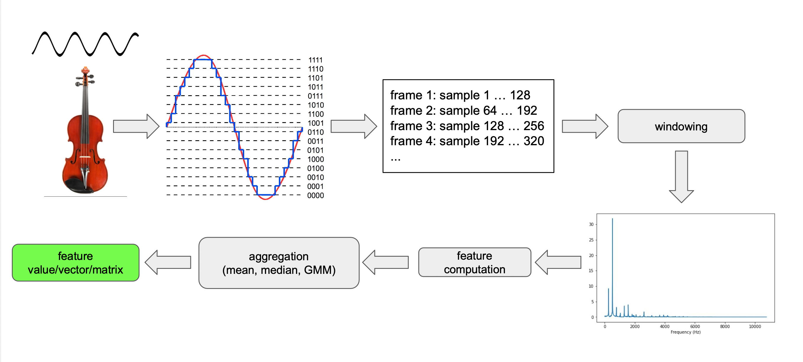</img>

## بررسی برخی از ویژگی‌های حوزه زمان

 همانطور که گفته شد، هر یک از ویژگی‌هایی که در ادامه مورد بررسی قرار می‌گیرند را برای هر فریم محاسبه می‌کنیم و سپس می‌توانیم تمام ویژگی‌های محاسبه شده را ترکیب نماییم(به عنوان مثال با محاسبه میانگین آنها).

1.  Amplitude envelope (AE):

حداکثر مقدار دامنه در میان همه نمونه های موجود در یک فریم. 

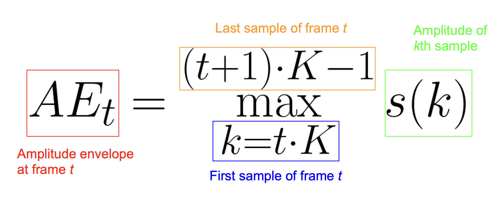</img>

> * این ویژگی می‌تواند ایده‌ای از بلندی صدا به ما بدهد.
> * مشکل این ویژگی این است که بسیار حساس به نمونه‌های پرت (outliers) است. به عنوان مثال این امکان وجود دارد که در یک فریم، اکثر نمونه‌ها دامنه‌ای بسیار پایین داشته باشند اما به دلیل وجود یک نویز گمراه کننده واکدار، بلندی فریم به اشتباه بسیار زیادتر به نظر آید.
> * از این ویژگی می‌توان برای تشخیص شروع یک واج یا یک نت موسیقی (onset detection) و یا دسته بندی ژانر موسیقی (music genre classification) استفاده نمود.

2. Root-mean-square energy (RMS):

جذر میانگین توان دو دامنه هر نمونه موجود در فریم (انرژی هر نمونه):

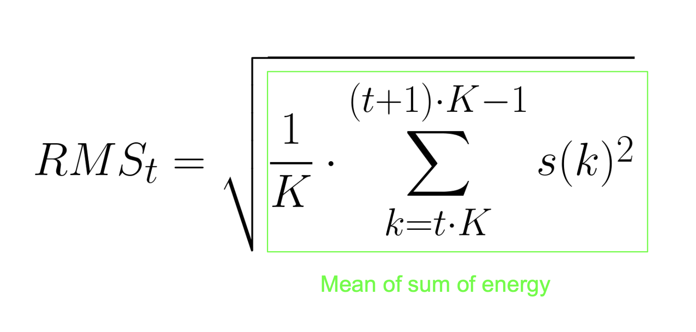</img>

> * این ویژگی نیز می‌تواند ایده‌ای از بلندی صدا بدهد.
> * نسبت به ویژگی قبل حساسیت کمتری به نمونه‌های پرت دارد، زیرا تمام نمونه‌های موجود در یک فریم در محاسبه نقش دارند.
> * می‌تواند برای تقسیم بندی صوت (audio segmentation) و یا تفکیک قسمت‌های واکدار و بی‌واک سیگنال به کار برود (زیرا بخش‌های واکدار سیگنال پرانرژی تر می‌باشند. 
> * مانند ویژگی قبل در دسته‌بندی ژانر موسیقی نیز قابل استفاده می‌باشد.

3. Zero crossing rate (ZCR):

بیانگر تعداد دفعاتی است که سیگنال محور افقی را قطع کرده است (از صفر عبور کرده است).
به عنوان مثال در شکل زیر نقاط سبز این مکان ها را علامت زده اند بنابراین برای این مثال نرخ عبور از صفر برابر با شش می‌باشد.

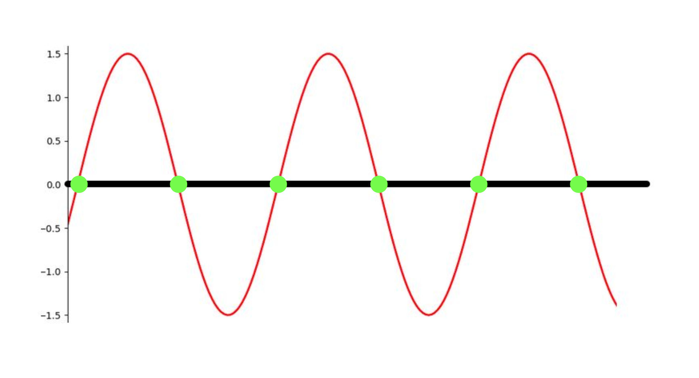</img>

برای محاسبه ZCR می‌توان از فرمول زیر استفاده نمود:

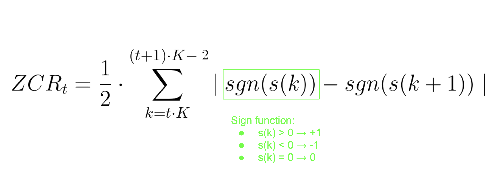</img>

> * از این ویژگی می‌توان برای تشخیص صدا‌های ناگهانی و کوتاه مدت استفاده نمود
> * همچنین می‌توان در سیگنال گفتار قسمت‌های بی‌واک و نویزی را از قسمت‌های واکدار تشخیص داد. زیرا قسمت‌های نویزی و بدون واک نرخ عبور از صفر بالاتری دارند.

## استخراج ویژگی‌ها حوزه‌ زمان در پایتون

نحوه‌ی کار با سیگنال صوت و استخراج ویژگی‌های معرفی شده حوزه‌ی زمان در نوت‌بوک 
<a href = "https://github.com/salehsargolzaee/Audio-Signal-Processing-and-Feature-Extraction/blob/main/time_domain_features.ipynb">time_domain_features.ipynb</a> به همراه توضیحات قرار گرفته. 

ویژگی‌ها و کاربرد‌های بسیار بیشتری در حوزه‌ی زمان وجود دارند.
در ادامه به بررسی و پیاده‌سازی یک مثال می‌پردازیم:

#####  مثال - تشخیص فرکانس گام  از روی ضرایب اتو‌کورولیشن (Autocorrelation):

ابتدا باید با ضرایب اتوکورولیشن آشنا شویم:

اتوکورولیشن یک سیگنال می‌تواند شباهت یک سیگنال را در برابر نسخه تغییر یافته زمانی خود توصیف کند:

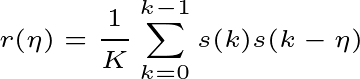

که در آن *η* برابر با میزانی از که سیگنال بر روی خودش شیفت داده شده است. به این مقدار پارامتر lag نیز گفته‌می‌شود. با توجه به فرمول قابل ملاحظه است که در *η* = 0 اتوکورولیشن بیشترین میزان خود را دارد. می‌توان با پیدا کردن میزان *η* که ما را به بیشترین مقدار بعدی می‌رساند و سپس تقسیم فرکانس نمونه برداری بر *η* محاسبه شده، فرکانس گام را محاسبه نمود.

<strong>
توجه داشته باشید که در صورت وجود نویز‌های واکدار، امکان وقوع کورولیشن‌های گمراه کننده افزایش می‌یابد، بنابراین بهتر است که پیش از محاسبه کورولیشن، سیگنال را کمی تمیز نماییم. برای اینکار می‌توان از روش Center Clipping استفاده نمود:

</strong>
در این روش مقدار ماکسیمم مطلق در ۱/۳ اول و آخر فریم محاسبه می‌گردد و سپس ۷۰٪ مینیمم این دو به عنوان سطح برش محاسبه می‌گردد (Clipping Level). سپس با استفاده از تابع زیر مقادیر جدید محاسبه می‌گردند:

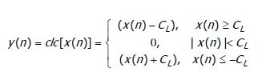

پیاده سازی این تمرین در نوت‌بوک <a href = "https://github.com/salehsargolzaee/Audio-Signal-Processing-and-Feature-Extraction/blob/main/autocorrelation_and_pitch.ipynb">autocorrelation_and_pitch.ipynb</a> قرار گرفته است.

