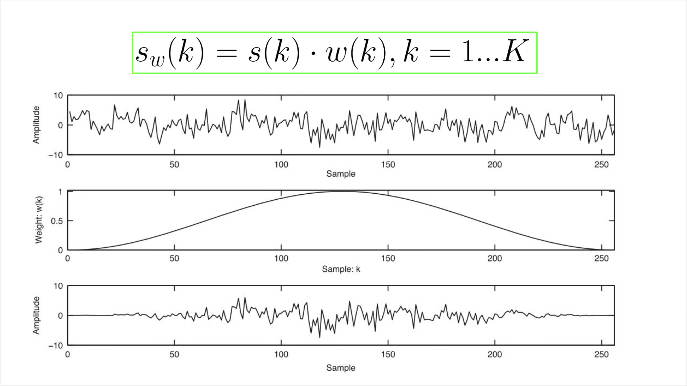

# مبانی پردازش زبان و گفتار

**پیاده سازی‌ها و توضیحات من برای تمرین های برنامه نویسی درس `مبانی پردازش زبان و گفتار` استاد [معطر](https://scholar.google.com/citations?user=SpBXgZUAAAAJ&hl=en).**

## انواع ویژگی‌های سیگنال صوت

به طور کلی ویژگی‌های سیگنال صوت (در حوزه سیگنال) میتوانند در سه دسته‌ی زیر قرار گیرند:

۱. ویژگی‌های حوزه زمان (Time domain features):

این ویژگی‌های قابل استخراج از شکل موج در حوزه زمان (  `Waveform` ) می‌باشند. 

- `Amplitude envelope` 
- `Root-mean square energy`
- `Zero crossing rate`
- ...

اما بدیهی است که فرکانس نیز تا حد زیادی می‌تواند توصیف کننده سیگنال صوت باشد. بنابراین دسته دیگری از ویژگی‌ها نیز مورد نیاز می‌باشند.

۲. ویژگی‌های حوزه فرکانس (Frequency domain features):

می‌توان با اعمال تبدیل فوریه بر روی سیگنال در حوزه‌ی زمان، سیگنال را در حوزه‌ی فرکانس نمایش داد. در اینصورت برخی از ویژگی‌هایی که از این نمایش قابل استخراج می‌باشند عبارتند از:

- `Band energy ratio` 
- `Spectral centroid`
- `Spectral flux`
- ...

همانطور که گفته شد، در هر یک از حوزه‌های بالا، تنها ویژگی‌های مربوط به همان حوزه قابل استخراج است. اما دسته‌ی دیگری از ویژگی‌ها وجود دارند که اطلاعاتی را در هر دو این حوزه‌ها در اختیار ما قرار می‌دهند.

۳. ویژگی‌های حوزه‌ی زمان-فرکانس (Time-frequency features):

برای استخراج اینگونه ویژگی‌ها می‌توان از نمایش‌های حوزه‌ی زمان-فرکانس استفاده نمود:

- `Spectrogram` 
- `Mel-Spectrogram`
- `Constatn-Q transform`
- ...

## روال کلی استخراج ویژگی‌های حوزه‌ی زمان و فرکانس

* #### روال کلی استخراج ویژگی در حوزه زمان:

۱. ابتدا سیگنال دیجیتال طی فرآیند `Analog to digital conversion (ADC)` به سیگنال دیجیتال تبدیل می‌گردد. این فرآیند خود شامل دو مرحله `نمونه برداری (sampling)` و `چندی سازی (quantization)` می‌باشد.

۲. سپس سیگنال دیجیتال حاصل فریم بندی (`framing`) می‌شود. 
معمولا برای سرعت بخشیدن به فرآیند تبدیل فوریه سریع، تعداد نمونه‌های موجود در هر فریم توانی از دو می‌باشد.
مدت یک فریم برابر است با:

که در آن *s**r* برابر با فرکانس نمونه‌برداری (sampling rate) و K برابر با تعداد نمونه‌های موجود در یک فریم (frame size) می‌باشد.

۳. در این مرحله آماده‌ی محاسبه ویژگی‌های حوزه‌ي زمان در هر یک از فریم‌ها هستیم. 

۴. پس از محاسبه ویژگی‌ها می توان با ترکیب آنها، یک بردار یا ماتریس ویژگی برای کل سیگنال تشکیل داد.

این فرآیند در شکل زیر به خوبی قابل مشاهده می‌باشد:

</img>

---

* #### روال کلی استخراج ویژگی در حوزه فرکانس:

مراحل ابتدایی مانند روال قبل اجرا می‌شوند

۱. ابتدا سیگنال دیجیتال طی فرآیند `Analog to digital conversion (ADC)` به سیگنال دیجیتال تبدیل می‌گردد. 

۲. سپس سیگنال دیجیتال حاصل فریم بندی (`framing`) می‌شود. 

سپس باید سیگنال را از حوزه‌ی زمان وارد حوزه‌ي فرکانس کنیم. این فرآیند معمولا با استفاده از تبدیل فوریه انجام می‌گردد. حاصل نموداری است که نشان دهنده‌ی تأثیر فرکانس‌های مختلف در سیگنال می‌باشد.

<strong>
اما پیش از انجام این تبدیل باید مسئله ای به نام `spectral leakage(نشت طیفی)` مورد بررسی قرار گیرد.
</strong>
---

> #### Spectral leakage:

> زمانی که تبدیل فوریه سیگنالی را محاسبه می‌کنیم که تعداد تناوب‌های آن عددی صحیح نمی‌باشد، با این مسئله روبرو می‌شویم. بنابراین واضح است که این مسئله بسیار در فریم‌ها رخ می‌دهد، زیرا وجود فریمی که شامل تعداد صحیحی تناوب باشد بسیار نادر است.
> اتفاقی که معمولا رخ می‌دهد این است که ابتدا و انتهای سیگنال نامتناوب است ( زیرا یک تناوب کامل را تشکیل نمی‌دهند ). این نواحی زمانی که به حوزه‌ی فرکانس تبدیل می‌گردند، تبدیل به فرکانس‌های بالا می‌شوند که در واقعیت وجود ندارند و صرفا حاصل نواحی نامتناوب ابتدا و انتها می‌باشند.

---

۳. برای حل این مشکل مرحله‌ی جدیدی به نام پنجره گذاری (windowing) انجام می‌شود. در این مرحله یک تابع پنجره گذاری بر روی هر فریم اعمال می‌گردد. پنجره‌ گذاری در واقع نمونه‌های ابتدایی و انتهایی هر فریم را حذف می‌کند که سبب به وجود آمدن سیگنالی نسبتا متناوب می‌شود. در نتیجه نشت طیفی کاهش می‌یابد.

در شکل زیر یکی از توابع پنجره گذاری پر کاربرد قابل مشاهده است (تابعی از هر نمونه k):

</img>

این تابع به صورت زیر بر روی سیگنال اعمال می‌گردد (بر روی هر نمونه):

</img>

همانطور که در شکل قابل مشاهده است، ابتدا و انتهای سیگنال حذف شده‌اند.

<b> اما حالا با مشکل دیگری روبرو هستیم. برای درک این مشکل تصور کنید که چند فریم را در کنار یکدیگر قرار داده‌ایم، در اینصورت می‌توانید در شکل زیر مشاهده کنید که در ابتدا و انتهای هر فریم ما سیگنال را در نتیجه فرآیند پنجره‌گذاری از دست داده‌ایم و طبیعتا نمی‌خواهیم  سیگنالی را از دست دهیم.</b>

</img>

---

> Overlapping Frames:

> برای حل این مشکل فریم‌بندی را به گونه‌ای انجام می‌دهیم که فریم‌ها با همدیگر همپوشانی داشته باشند. در اینصورت می‌توانیم تا حدی اطلاعات از دست رفته در شکل بالا را جبران نماییم.
در شکل زیر فریم اول و دوم به با هم همپوشانی دارند. به تعداد نمونه‌هایی که از ابتدا هر فریم تا ابتدا فریم بعدی قرار دارد مقدار شیفت یا پرش (hop length) گویند. اگر اندازه هر فریم را برابر با K در نظر بگیریم، اندازه همپوشانی برابر با `K - hop length` خواهد بود.
---

</img>

۴.در این مرحله تبدیل فوریه اعمال می‌گردد

مراحل بعدی مانند فرآیند فبلی در حوزه زمان انجام می‌شوند:

۵. محاسبه ویژگی‌های حوزه فرکانس.

۶.  پس از محاسبه ویژگی‌ها می توان با ترکیب آنها، یک بردار یا ماتریس ویژگی برای کل سیگنال تشکیل داد.

این فرآیند نیز در شکل زیر به خوبی قابل مشاهده می‌باشد:

</img>

